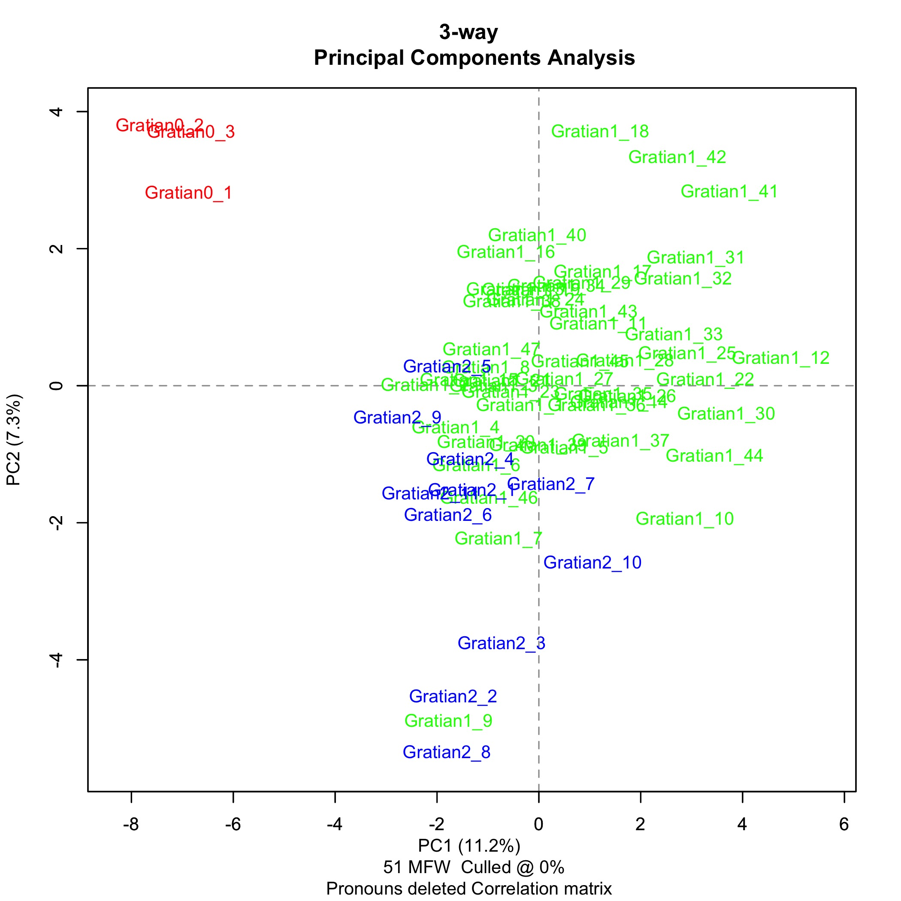
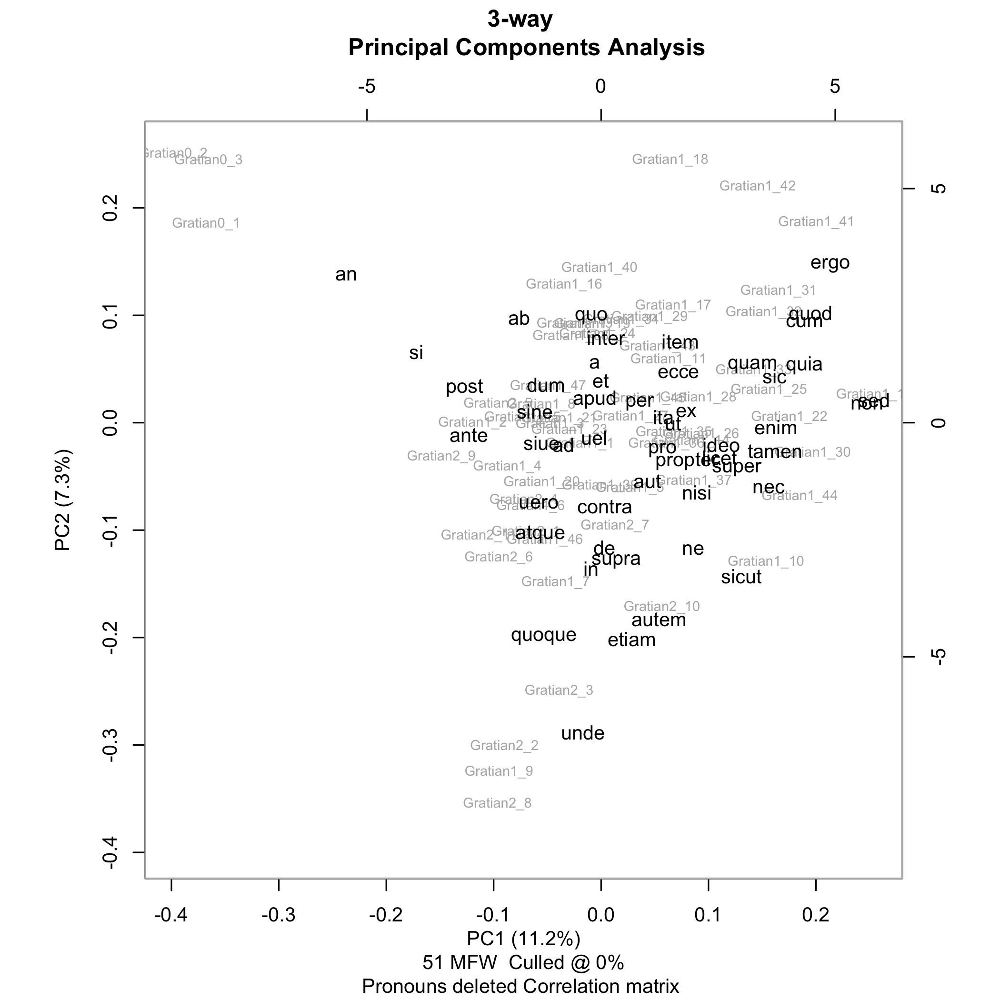
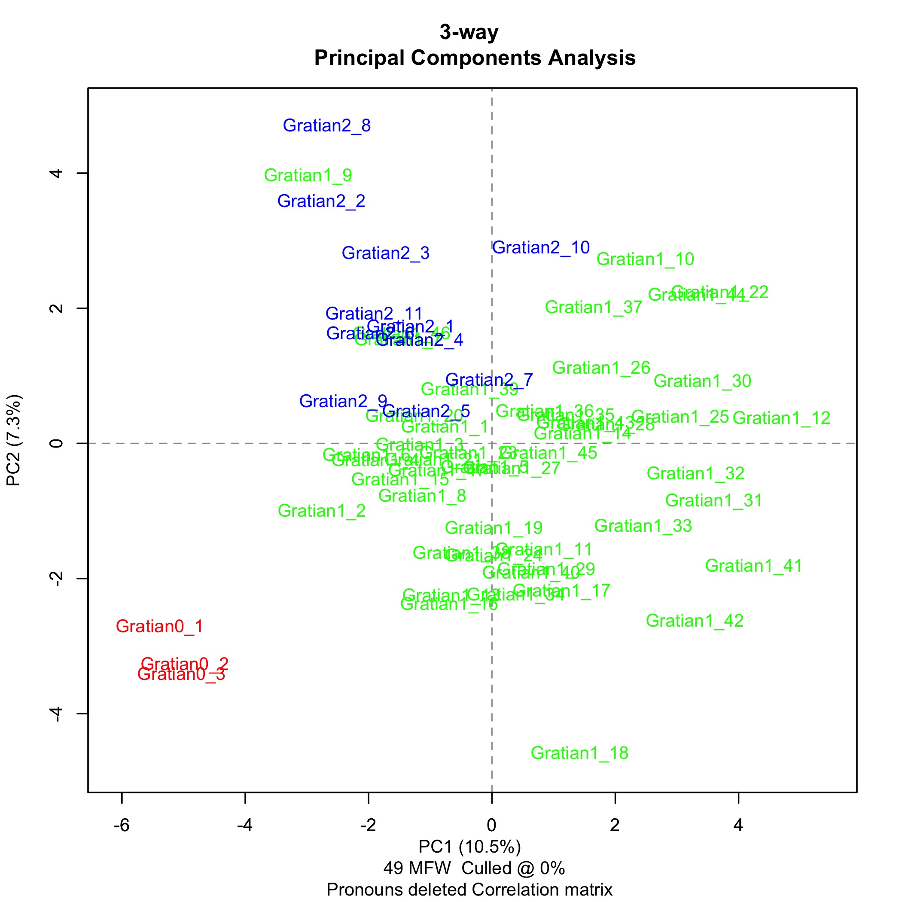
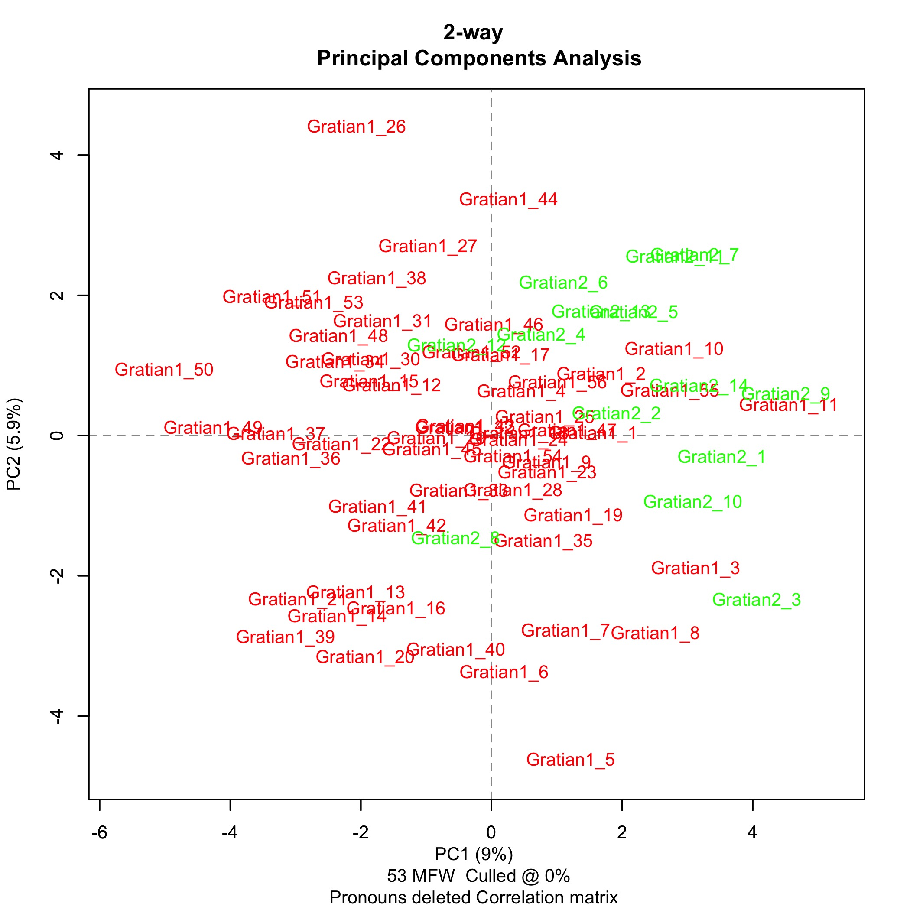

Twenty years ago, Anders Winroth announced his discovery of the
first recension of Gratian's _Decretum_ at the Tenth International
Congress of Medieval Canon Law in Syracuse, New York. Melodie
Eichbauer has recently summarized the subseqent debates over whether
the _Decretum_ was compiled and circulated in two distinct recensions,
or whether it was instead the product of evolution.
[@eichbauer_gratians_2013] Debate over the two-recension theory
overlaps with debate over authorship: Was Gratian 1, the compiler
of the first recension the same person as Gratian 2, the compiler
of the second recension? It does not appear that the debate over
authorship can be settled with currently available evidence. So,
my question is: Can stylometry provide new evidence about the
identity of Gratian 1 and Gratian 2?

First I'm going to discuss in general terms the use of stylometry
for authorship attribution. Then, I'm going to discuss the methodology
and the program that I am using for this project. Finally, I am
going to show the results of stylometric analysis of the case
statements, the first-recension _dicta_, and the second-recension
_dicta_, and discuss some possible interpretations of those results.

Stylometry is the measurement of style. According to one recent
definition, "[s]tyle is a property of texts constituted by an
ensemble of formal features which can be observed quantitatively
or qualitatively." [@herrmann_revisiting_2015, 44]

So while style itself has both qualitative and quantitative aspects,
stylometry is concerned only with quantitative aspects of style.
One well-established use of stylometry is to attribute authorship.
And for the purpose of authorship attribution, the formal linguistic
features that stylometry measures are the frequencies of occurrence
of function words.

Linguists draw a distinction between function words and content
words. Function words are words like prepositions and conjunctions.
Content words are words like adjectives, nouns and verbs. Function
words convey meaning by their use in grammatical structure. The
conjunction "but" doesn't mean anything by itself, but rather it
places two words or grammatical constructs into an adversative
relationship with each other.

Here's another way of thinking about the distinction: function words
are closed-class words and content words are open-class words.
Language-speaking communities can and do make up new adjectives and
nouns and verbs all the time; so content words are an open class
that can be added to at will. But new prepositions and conjunctions
are almost never added to a language, and they change very slowly
over time, if they change at all, and are therefore, for all practical
purposes, a closed, finite, class. In theory, that means that you
ought to be able to make a list of every function word in a language,
although in practice, that's not easy to do.

Evidence from experimental psychology suggests that both authors
and readers process function words at an unconscious level.
[@kestemont_function_2014] The frequency with which a given author
uses particular function words is therefore considered to be more
or less invariant, making it a reliable authorial signal.

Stylometric analysis of the frequency of functions words for the
purpose of attributing authorship has had a number of notable
successes. The validity of this approach for textual scholarship
was firmly established by the work of Frederick Mosteller and David
L. Wallace on the _Federalist Papers_. The authorship of 12 of the
_Federalist Papers_ had been disputed since the early 19th century,
with competing claims advanced on behalf of Alexander Hamilton and
James Madison. In 1944, Douglass Adair, using traditional scholarly
methods, settled the dispute largely to the satisfaction of early
American historians, determining that Madison was the author of all
12 of the disputed numbers. In 1964, Mosteller and Wallace confirmed
Adair's findings by conducting a stylometric analysis of the
frequencies of 30 function words to compare the 12 disputed numbers
with numbers securely attributed to Hamilton and Madison.

Let's take a first look at how this kind of stylometric analysis
works in practice with some actual data from the first- and
second-recension _dicta_.[^4] "_In_" is the most frequently occurring
word in the _dicta_. There are 1,450 occurrences of "_in_" out of
56,713 words in the first-recension _dicta_ (2.56%). There are 411
occurrences of "_in_" out of 14,255 words in the second-recension
_dicta_ (2.88%). "_In_" therefore occurs 13% more frequently in the
second-recension _dicta_ than it does in the first-recension _dicta_.

[^4]: Does _not_ include either first- or second-recension _dicta_
from _de Pen_.

"_Non_" is the second most frequently occurring word in the _dicta_.
There are 1,360 occurrences of "_non_" in the first-recension _dicta_
(2.40%). There are 306 occurrences of "_non_" in the second-recension
_dicta_ (2.15%). "_Non_" therefore occurs 12% more frequently in
the first-recension _dicta_ than in the second-recension _dicta_.

13% for "_in_" and 12% for "_non_" are significant variations for
such common words---it's not like we're talking about low-frequency
words where a small difference in the count can make for a big
difference in percentage.

We could graph the number of occurrences of "_in_" and "_non_" per
100 words of the two samples (from the first- and second-recension
_dicta_), with the percentage frequency of "_in_" on the horizontal
axis, and the percentage frequency of "_non_" on the vertical axis,
and we would have an extremely simplistic visualization of the total
variation between the two samples. Now, we are obviously not going
to make an attribution of authorship based on the frequencies of
only two function words.

Increasing the number of function words one collects data for
increases the accuracy of the stylometric analysis (up to a point).
But it also introduces a new problem. We were able to represent our
stylometric analysis of the frequency of "_in_" and "_non_" in the
samples from the first- and second-recension _dicta_ on a two-dimensional
graph. But there will be as many dimensions on the graph as there
are function words for which we collect data. And because human
beings are not good at visualizing quantitative data in more than
three dimensions, we need to find a way to reduce the number of
dimensions. This is where the technique of principle component
analysis, or PCA, becomes useful.[^pca]

[^pca]: For a general introduction to the use of principal component
analysis (PCA) in literary stylometric analysis, see @craig_stylistic_2004
and Chapter 6 "Style" in @jockers_macroanalysis_2013.

PCA first combines as many of the raw dimensions as possible into
synthetic components on the basis of strong correlations, either
positive or negative. For example, going back to the data on the
frequencies of "_in_" and "_non_" in the first- and second-recension
_dicta_, the two dimensions of the graph could be collapsed into a
single component that could be thought of as representing the
probability that "_in_" will and that "_non_" will _not_ occur in
a given sample.

Finally, PCA displays the two components that contribute the most
to the total variation between the samples, and graphically arranges
the samples according to their probability relative to those two
components.

An important (and time-consuming) aspect of any project of this
nature is corpus preparation. A baseline requirement for carrying
out stylometric analysis is the availability of an electronic text.
Ideally, I would be working with electronic texts of good critical
editions of both the first and second recensions of Gratian's
_Decretum_, following consistent orthographic conventions, and
encoded in a standard format like TEI P5 XML. The Mellon
Foundation-supported project, directed by Anders Winroth, to edit
the first recension is making progress, but is not yet complete
enough for me to use on this project. So, I am working with the
electronic text of the Friedberg edition that Timothy Reuter and
Gabriel Silagi used to produce the _Wortkonkordanz zum Decretum
Gratiani_ for the MGH. The MGH e-text is encoded in the obsolete
Oxford Concordance Program format. The OCP format is very difficult
to parse because it is not tree-structured---it has start tags for
elements such as canons and _dicta_, cases and distinctions, but
not end tags.

Anders Winroth and Lou Burnard of the Oxford Text Archive (OTA)
each provided me with copies of the MGH e-text. The copies differed,
and I went through an exercise not unlike preparing a critical
edition to restore the e-text to the state that Reuter and Silagi
intended.

I generated the sample text for the first-recension _dicta_ by
extracting from the MGH e-text of the Friedberg edition all of the
_dicta_ listed by Winroth in the appendix of _The Making of Gratian's
Decretum_, and by applying the changes to the _dicta_ that differed
between the first and second recensions. I generated the sample
text for the second-recension _dicta_ by starting with all the
_dicta_ in parts 1 and 2 of the Friedberg edition, and then taking
away every word that appeared in the first-recension _dicta_. For
the case statements, I simply used the text from the vulgate
_Decretum_ as it appears in the Friedberg edition.

Because stylometric analysis for authorship attribution depends on
the frequencies of prepositions and conjunctions, it is important
to include enclitics substituting for conjunctions. Every word in
the samples with a -_que_ ending that is actually an enclitic, and
not just part of the word, have been mapped to the word plus the
pseudo-conjunction "xque".[^schinke]

[^schinke]: In the case statements, 1st-, and 2nd-recension _dicta_
from Gratian's _Decretum_, there are 747 occurrences of 79 unique
words ending in -_que_. (This does not count 423 occurrences of the
word '_que_' itself.) Of those, 498 are occurrences of 19 unique
words from Schinke's 54-word pass list, while 249 occurrences of
60 unique words are not. It is from these 249 words that, according
to Schinke, the -_que_ ending should be detached as an enclitic.

    However, the 249 words include 72 occurrences of 17 unique words
    ending with the adverbial enclitics -_cumque_ or -_cunque_,
    from which the -_que_ ending should not be detached. The 249
    words also include a further 149 occurrences of 21 unique false
    positives:

    cumque, eque (aeque), namque, pleraque, plerique, plerisque,
    plerumque, quinque, unamquamque, unaqueque, unicuique,
    uniuscuiusque, unumquemque, unusquisque, usquequaque, utramque,
    utraque, utrique, utrisque, utriusque, utrumque.

    This leaves only 28 occurrences of 22 unique words from which
    the -_que_ ending should actually be detached as an enclitic.

    False positives over-represent the frequency of occurrence of
    the -_que_’ enclitic as a conjunction by an order of magnitude.
    Including all false positives makes 'xque' the 37th most frequent
    word in the sample, while excluding them makes it the 376th
    most frequent word. There are 55 occurrences of the word
    '_namque_', the most frequently occurring false positive.
    Detaching the '-_que_' ending from '_namque_' overstates the
    frequency the frequency of '_nam_', making what is actually the
    480th most frequent word appear to be the 130th, while making
    '_namque_', which is actually the 176th most frequent word in
    the samples when false positives are excluded, disappear from
    the list altogether.

Now that we have the preliminaries out of the way, we can take a
look at the results. I used the stylo R package to generate all of
the plots that I'm going to show you today. (R is a statistical
programming language.) Mike Kestemont, Maciej Eder, and Jan Rybicki
of the Computational Stylistics Group developed the package, and
Mike Kestemont in particular has been very generous in his technical
advice for this project.

Here is the plot of a three-way comparison between the case statements,
the first-recension _dicta_, and the second-recension _dicta_. The
case statements are red, the first-recension _dicta_ are green, and
the second-recension _dicta_ are blue. Each of the texts has been
divided into 1200-words samples. Principal component 1, along the
horizontal axis is 11.2%. Principal component 2, along the vertical
axis is 7.3%. That is, PC1 explains 11.2% of the total variation
between the samples, and PC2 explains 7.3% of the total variation
between the samples. This is good: as a general rule, we want to
see a value for PC1 greater than 10% and we want to see a value for
PC2 greater than 5%. The most striking feature of this plot is the
fact that the case statements are so far away from the _dicta_, and
the next step is to take a look at which function words are producing
that effect.

Turning on a stylo option called "feature loadings" lets us see how
strongly particular words influence the placement of text samples
along the PC1 and PC2 axes. The documentation calls this the feature's
"discriminative strength." For example, we see that "_sed_" and
"_non_" are way out on the right of the PC1 axis, while "_unde_"
is way down at the bottom of the PC2 axis.

Remember that in our first experiment with counting function words,
"_non_", the second most common word in the samples, was strongly
associated with the first-recension _dicta_. Here we see "_non_"
on the far right, and in fact the samples from the first-recension
_dicta_ (but not from the second-recension _dicta_) tend to spread
out to the right. Note also that "_in_", the most common word in
the samples, is actually pretty close to the middle. So, it's not
so much that the second-recension _dicta_ have more occurrences of
"_in_", it's that the first-recension _dicta_ have fewer.

What is really interesting here is that "_an_" and "_si_" cluster
with the case statements, "_an_" very strongly, "_si_" somewhat
less so. This makes sense because indirect questions dominate the
language of the case statements. It is a question of genre. So the
next step in the stylometric analysis is to control for genre by
removing the question words "_an_" and "_si_" from the list of
function words.

We've now reached the final stage of the three-way comparison between
the case statements, the first-recension _dicta_, and the
second-recension _dicta_. We are now using the 49 most frequent
words on our function list instead of the 51 most frequent words,
having commented out "_an_" and "_si_". And even without "_an_" and
"_si_", PC1 still explains 10.5% of the total variation between the
samples, down slightly from 11.2%. PC2 still explains 7.3% of the
total variation between the samples. So, even controlling for genre,
the distance between the case statements and the _dicta_---both
first- and second-recension---is still quite striking.

To turn to the other interesting aspect of the three-way comparison,
you'll note that the second-recension _dicta_ in blue cluster
strongly to the upper-left quadrant. Now, Mike Witmore, a member
of my dissertation committee who isn't an insider with respect to
the Gratian 1 vs. Gratian 2 debate, but is very experienced in the
use of stylometry, was quite optimistic on the basis of this evidence
that the first- and second-recension _dicta_ might be statistically
distinguishable.

So, in an attempt to take a closer look at the _dicta_ by themselves,
I removed the case statements and ran a two-way comparison of
1000-word samples of the just first- and second-recension _dicta_.
(Stylo changes the color assignments depending on the number of
samples, so in this plot the first-recension _dicta_ are red and
the second-recension _dicta_ are green.) And the results are
ambiguous. The PC1 axis is 9%, somewhat under the 10% threshold we
would like to see. Also, although we still see the second-recension
_dicta_ clustering mostly to the right of the PC1 axis, the two
sets of samples are not separated as cleanly as we'd like to see,
and certainly nowhere near as cleanly as the case statements were
from the _dicta_. And here we've reached the current frontier of
my research.

##Conclusion

The conclusion that I draw from my analysis of the case statements,
the first-recension _dicta_, and the second-recension _dicta_, is
that the author of the case statement was not the same person as
the author or authors of the _dicta_. It is an unexpected and in
some ways unwelcome conclusion, and I have spent the better part
of the past two years trying to make it go away---that is, to control
for any features that might exaggerate the separation between the
case statements and the _dicta_. The other, more tentative, conclusion
that I draw is that it is going to be hard to make a clear case for
either one or two authors for the _dicta_, and it appears that the
authorship of Gratian's _Decretum_ is considerably more complicated
than we have imagined.

#Bibliography

